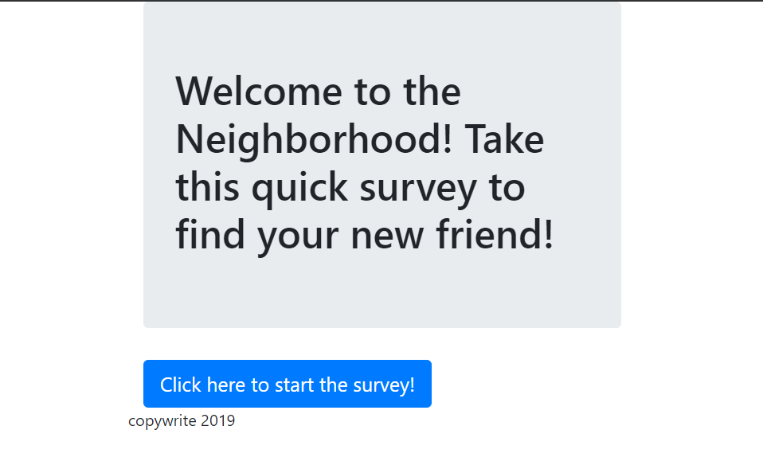
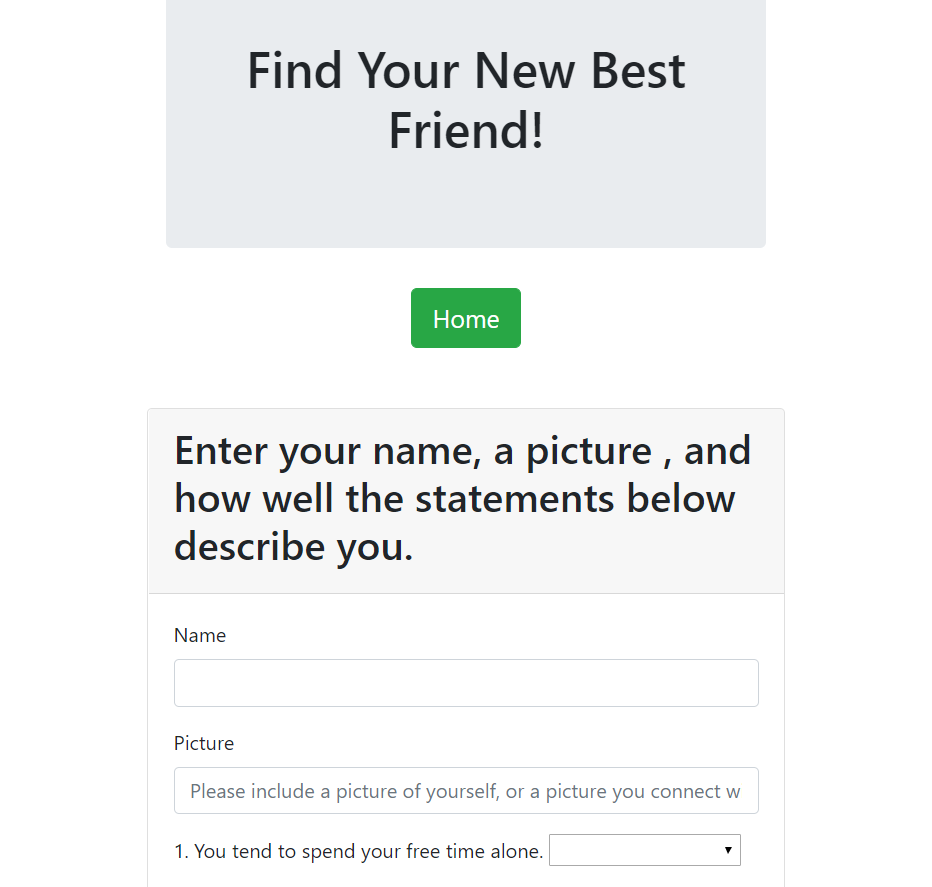
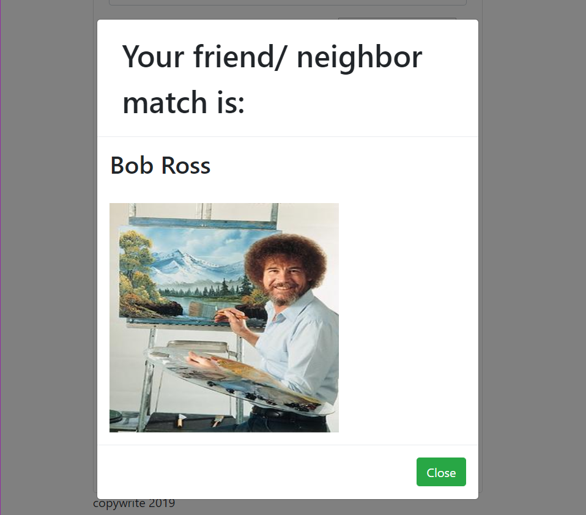

# Friend_Finder

<h1>Description</h1>
<h5>An app created to demonstrate the use of express servers, with node and javaScript. Simmilar to many dating apps, this Full-Stack web application takes in Data obtained from a User survey, stores said data in a database and then will compare the new survey results with all site surveys, and then return a best match.</h5>

<h2>Set up</h2>
<h5>In order to run this application you will need to run the npm install command, in the file destination in console log. This should install the npm 

To run the application locally  please follow the steps below:
** or visit [This link will open the live page on Heroku](https://ancient-fortress-22030.herokuapp.com/)

* clone into the repo using this link: https://github.com/Cmoconnor0823/Friend_Finder.git 
* cd Friend_Finder
* npm install
* node server.js </h5>

<h3>Finding Friends</h3>
<h6>When the application is loaded you will be taken to the home page. From here click on the button to be directed to the survey page. Fill out the survey making sure to complete all fields. When the survey is complete click submit and a modal will pop up with your closest match. Feel free to enter however many friends you would like.</h6>

 

 

 

<h2>Technology</h2>
This page was built with the following NPM Modules, and technologies:

* [express](https://www.npmjs.com/package/express) 

* [path](https://www.npmjs.com/package/path)

* [BootStrap](https://getbootstrap.com/)

* [Git Bash](https://gitforwindows.org/)

* [Heroku](https://id.heroku.com/login)

* [Visual Studio Code](https://code.visualstudio.com/)

* [JavaScript](https://developer.mozilla.org/en-US/docs/Web/JavaScript/Reference)

For comments/ concerns contact the project 
Author: Caitlin O'Connor  
At: Cmoconnor0823@gmail.com
